# Tic-Tac-GO

Tic-Tac-GO is a website with a GO backend and a Javascript frontend where people can play 
tic-tac-toe against there friends, family, and random people online. The vision for this site is to
have users who enter the website be presented with two choices; to play with a friend or play with
a stranger. Once a choice has been made, the user will either join an available room when playing 
with anotheruser or they will create a room to join with their friend. Once both parites are in the
room, the regular game of tic-tac-toe will begin. Once a player wins, both players will be
presented the option to either have a rematch or exit the game. If rematch is selected by both 
players, then a new game will commence within the same room. However, if either of them hits exit,
the game ends and the room is destroyed.  

## Components

The application will conist of three main components:
1) Javascript frontend for users to interact with.
2) Golang backend where user inputs will be captured and input into a database.
3) Redis database to manage game rooms.


## Redis Database

A redis database was chosen becuase I used it at work and that is what I am familiar with LMAO.
It's atomic nature will definitely be useful at the very least.

The redis database will be used to track the creation of two different types of game rooms, 
_**public**_ and _**private**_ rooms. Each room will have their own data structures associated with
them.

### Public Rooms

Below is a list that contains the IDs of all of the available public rooms that a new player can 
join.

```
Public:Rooms:Available [<uuid1>, <uuid2>, <uuid3>]
```

The below hash will be used to keep track of the state of the game in a room.

```
Public:Room:<uuid> p1 <uuid> p2 <uuid> websocket <ws>
```

### Private Rooms

Private rooms will only have the below hash associated with it.

```
Private:Room:<uuid> p1 <uuid> p2 <uuid> gameState <base3> websocket <ws>
```

### Public Game Sequence Diagram

```mermaid
sequenceDiagram
    participant Player1
    participant Server
    participant Database
    participant Player2

    rect rgb(0, 0, 50)
    Note over Player1, Database: Player1 Creates a Room on One Thread of the Server
    Player1->>Server: Start Game with <br> Random Stranger 
    Note over Player1, Server: ws/public <br> Initialize WS Connection <br> Message: Join Room

    Server->>Database: Is a Public Room Available
    Note over Server, Database: LLEN Public:Rooms:Available<uuid>
    Database-->>Server: No Rooms Available

    Server->>Database: Create Available Public Room
    Note over Server, Database: HSET PUBLIC:room:<uuid> p1<uuid> <br> gameState 000000000 websocket <ws>
    Note over Server, Database: RPUSH PUBLIC:rooms:available <uuid>
    Database-->>Server: Success

    Server-->>Player1: Waiting for Random <br> Stranger to Join
    Note over Player1, Server: ws/public
    end

    rect rgb(50, 0, 0) 
    Note over Player2, Server: Player2 Joins a Room on Another Thread of the Server

    Player2->>Server: Start Game with <br> Random Stranger 
    Note over Player2, Server: ws/public <br> Initialize WS Connection <br> Message: Join Room

    Server->>Database: Is a Public Room Available
    Note over Server, Database: LLEN Public:Rooms:Available<uuid>
    Database-->>Server: Room Available

    Server->>Database: Join Available Room
    Note over Server, Database: RPOP Public:Rooms:Available<uuid>
    Note over Server, Database: HSET PUBLIC:room:<uuid> p2<uuid> <br> gameState 000000000 websocket <ws>
    Database-->>Server: Success
    end
    
    Server->>Player1: Start Game
    Note over Player1, Server: ws/public <br> Start Game
    Server->>Player2: Start Game
    Note over Player2, Server: ws/public <br> Start Game
```


